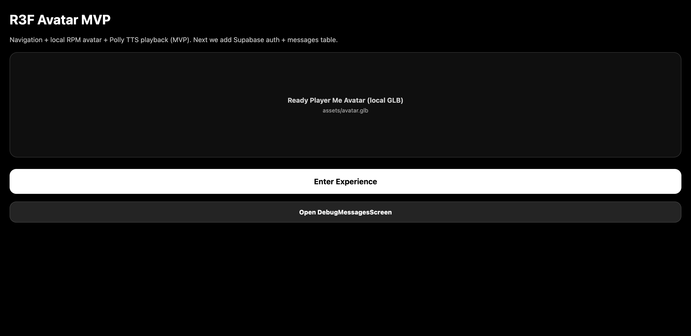
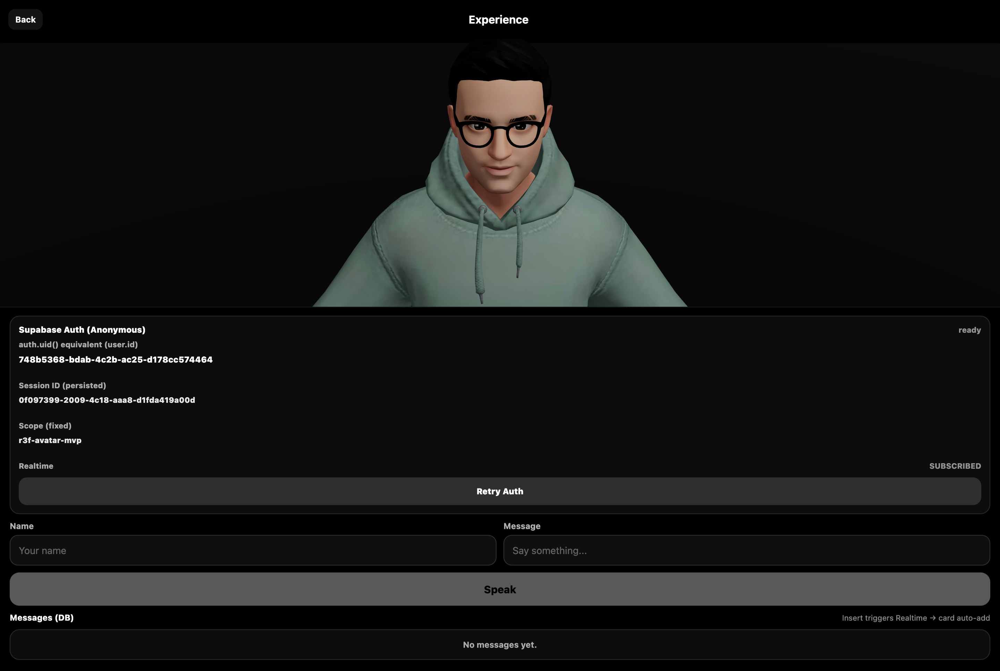
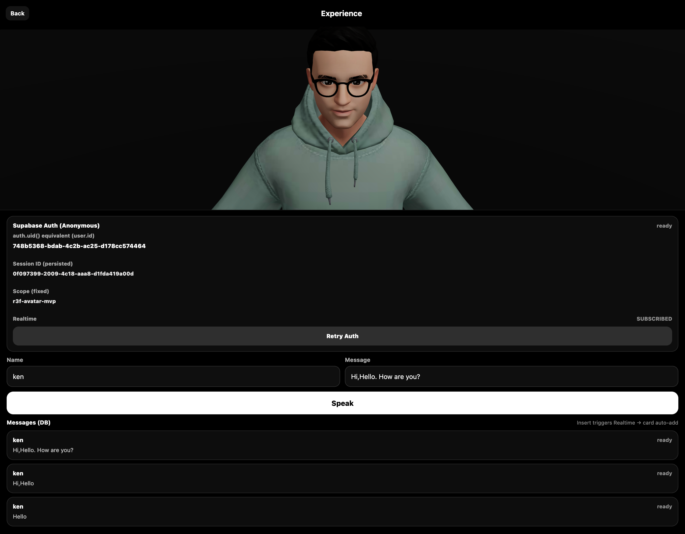
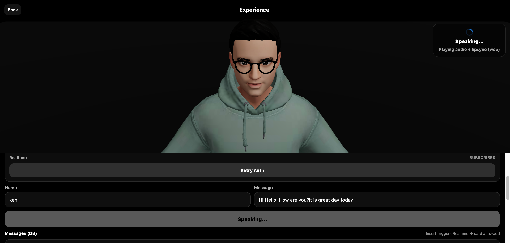
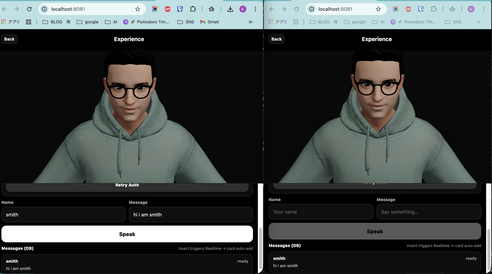
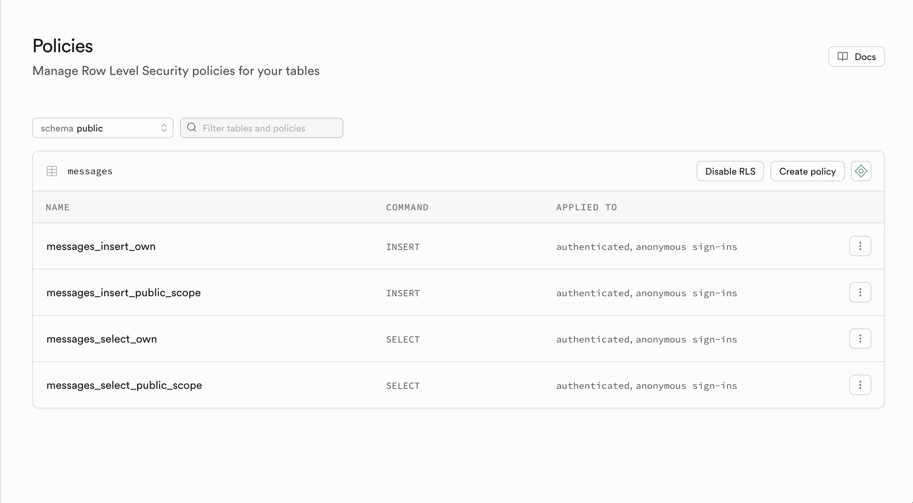

# R3F Avatar MVP — Real-Time Supabase Messaging + TTS + Wawa Lipsync

A React Native (Expo) app that renders a 3D avatar + simple 3D environment using **React Three Fiber**, lets users enter **Name + Message**, then saves messages to **Supabase** (user-isolated), subscribes via **Realtime**, and plays **TTS audio**.  
On **Web**, the app uses **Wawa Lipsync** to drive mouth morph targets from the generated speech audio.

> **Honest note (assessment constraint):**  
> Wawa Lipsync is currently implemented **for Web only** in this submission. On iOS/Android, the app still plays TTS audio and animates the avatar, but mouth movement uses a **simple fallback animation** instead of audio-analysis-driven visemes. See **Known limitations**.

---

## Demo

- Demo video: <https://youtu.be/HtVsSOyrdqU>

---

## What this demonstrates (mapped to the case study)

- ✅ React Native + TypeScript + modern patterns (hooks, modular helpers)
- ✅ 3D rendering on mobile (R3F + Drei + Expo GL)
- ✅ 3D avatar loading via `useGLTF()` + animations via `useAnimations()`
- ✅ 3D environment/background (simple scene parts)
- ✅ Session management (persistent `sessionId` using UUID + AsyncStorage)
- ✅ Supabase Auth (anonymous) + user-isolated messaging
- ✅ Realtime subscription per user (`user_id` filter)
- ✅ TTS audio playback (Expo AV) + local audio caching
- ✅ Performance: Suspense fallback + asset preload/caching + TTS caching

---

## Screens / Navigation

- **Landing**
  - Intro text
  - “Enter Experience” button
- **Experience**
  - 3D avatar + 3D background scene
  - Inputs: **Name**, **Message**
  - Button: **Speak**
  - UI cards/log showing submitted + realtime messages

(There is also an optional debug screen used during development.)

---

## Tech Stack

- **React Native / Expo**
- **TypeScript**
- **React Navigation**
- **3D:** `three`, `@react-three/fiber`, `@react-three/drei`
- **Expo GL / Three adapter:** `expo-gl`, `expo-three`
- **Audio:** `expo-av`, plus file caching via `expo-file-system`
- **Realtime DB:** Supabase (`@supabase/supabase-js`)
- **Lipsync (Web):** `wawa-lipsync`

---

## Requirements

- Node.js 18+
- Expo CLI (via `npx expo ...`)
- A Supabase project (URL + anon key)

---

## Setup

### 1) Install

```bash
npm install
```

### 2) Environment variables

Create a `.env` in the project root:

```bash
EXPO_PUBLIC_SUPABASE_URL="https://xxxxx.supabase.co"
EXPO_PUBLIC_SUPABASE_ANON_KEY="your_anon_key"
EXPO_PUBLIC_POLLY_URL="https://<your-tts-endpoint>/?text={text}&voiceId={voiceId}&format=mp3&engine=neural"
# Optional, only if you wire any OpenAI-based helpers:
# EXPO_PUBLIC_OPENAI_API_KEY="..."
```

> **TTS endpoint:**  
> This project expects a URL that returns an `audio/mpeg` stream.  
> Example query params are `text`, `voiceId`, `format`, `engine`, `tone` (depending on your service).

### 3) Add the avatar asset

Place your avatar file at:

```
assets/avatar.glb
```

The app expects this exact path by default.

> **Important for submissions:** ensure `assets/avatar.glb` is included in your ZIP/repo.  
> If you use a packaging script, do not exclude large files (e.g. remove any `--max-size=...` filters that would drop the `.glb`).

---

## Supabase Setup

### 1) Create the table

Run this SQL in Supabase (SQL Editor):

```sql
create table if not exists public.messages (
  id uuid primary key default gen_random_uuid(),
  created_at timestamptz not null default now(),
  user_id uuid not null,
  session_id text not null,
  scope text not null default 'experience',
  name text not null,
  message text not null
);

create index if not exists messages_user_id_idx on public.messages (user_id);
create index if not exists messages_created_at_idx on public.messages (created_at desc);
create index if not exists messages_session_id_idx on public.messages (session_id);
```

### 2) Enable Row Level Security (RLS)

```sql
alter table public.messages enable row level security;
```

### 3) Add policies (user isolation)

```sql
create policy "messages_insert_own"
on public.messages
for insert
to authenticated
with check (user_id = auth.uid());

create policy "messages_select_own"
on public.messages
for select
to authenticated
using (user_id = auth.uid());
```

### 4) Enable Realtime for the table

In Supabase Dashboard: **Database → Replication / Realtime** and enable `public.messages`.

If you prefer SQL (older setups), you may also need:

```sql
alter publication supabase_realtime add table public.messages;
```

---

## Running the app

### Web

```bash
npx expo start --web
```

### iOS / Android

```bash
npx expo start
```

Then open in **Expo Go** (or your dev client).

---

## How to verify concurrency / isolation

1. Open the app in **two separate sessions** (e.g. two browsers, or browser + phone).
2. Each session signs in anonymously to Supabase.
3. Each session subscribes to Realtime with a `user_id` filter.
4. Send messages from each session and confirm:
   - You see your own messages in realtime
   - You do **not** see other users’ messages (isolation via `user_id` + RLS + filtered subscription)

---

## Implementation notes

### Message flow (Experience)

1. User enters **Name + Message**
2. App ensures:
   - `sessionId` exists (UUID persisted in AsyncStorage)
   - Supabase anonymous auth is available (get `user_id`)
3. Insert row into `public.messages`
4. Realtime subscription receives inserts for that `user_id`
5. UI cards update immediately (local optimistic add + realtime confirmation)

### Audio / TTS

- TTS audio is fetched as an MP3 URL and played via `expo-av`
- Audio is cached locally to avoid refetching the same text repeatedly

### Lipsync

- **Web:** Uses Wawa Lipsync to analyze the audio and map visemes → avatar morph targets
- **iOS/Android:** Uses a lightweight fallback mouth animation (time-based) while audio plays

---

## Performance considerations included

- **Suspense fallback** while 3D assets load
- **Asset preloading / caching** for the avatar model
- **TTS caching** to avoid repeated downloads

---

## Known limitations (honest)

### 1) Wawa Lipsync is Web-only in this submission

Wawa Lipsync relies on WebAudio-style decoding/analysis which is straightforward on Web but not directly available in the same way in Expo managed runtime.  
Therefore, iOS/Android currently use a simple fallback mouth animation.

### Planned mobile approach (next steps)

If continuing beyond the assessment window, the recommended path is:

- **WebView analyzer approach:** run Wawa Lipsync inside a WebView to compute a viseme timeline, then send viseme events to React Native to drive morph targets in the native R3F scene.

---

## Troubleshooting

- **No avatar renders:** confirm `assets/avatar.glb` exists and is included in your repo/zip
- **No realtime updates:** confirm Realtime is enabled for `public.messages` and RLS policies allow `select`
- **401 / auth issues:** confirm anonymous auth is enabled and `.env` has correct Supabase URL/key
- **CORS (Web TTS):** ensure your TTS endpoint includes permissive CORS headers for `http://localhost:*`

---

## Attribution / Licensing

- Avatar model: (add source + license here — must be redistributable for public repo)
- Libraries: Three.js, React Three Fiber, Drei, Supabase, Wawa Lipsync

## Screenshots

### Landing

“Landing screen with navigation into the 3D Experience.”


### Experience (3D + input)

“Experience screen (authenticated anonymous session + realtime subscribed).”


### Message submit → DB insert → UI cards

“Submitting a message inserts into Supabase and renders message cards.”


### Speaking (TTS + lipsync indicator)

“TTS playback + real-time lipsync indicator during speech.”


### Realtime (two concurrent sessions)

“Two concurrent sessions (separate windows/devices) running simultaneously.”


### Supabase RLS policies

“Supabase RLS policies for insert/select isolation and scoped access.”

